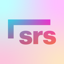

# srs :: a spaced repetition app

## NOTE: THIS APP IS NOT FINISHED.
The UI has no styling and many QoL features (and features in general) are missing.
However, the base of it is works and properly schedules cards.

## Usage

### Getting Started
To install srs, download the latest version from the Releases panel, then run the installer.

To add decks, open the Decks tab and press the add button and open a local JSON file to import the deck, or create one manually.
The deck will be imported as the file name, which can be changed by clicking on the deck in the Decks window and selecting "Rename".
Sample decks can be found in the `decks` folder of this repository.

### Features
srs supports standard Markdown on cards, along with the following extras:

| Feature | Usage         |
|---------|---------------|
| Ruby    | {Bottom\|Top} |

## Development

### Todo List
Please don't open issues about the following items, as I am actively working on them:
- Better UI (in general, issues requesting a specific feature are fine)
- LaTeX support
- Moving cards
- Refreshing windows automatically

However, pull requests related to any of these issues are always appreciated.

### License
srs is licensed under the Mozilla Public License, version 2.0, and is marked "Incompatible With Secondary Licenses".
The full license file can be found in the `LICENSE` file or at https://mozilla.org/MPL/2.0/.
However, I am willing to distribute the project under certain alternative licenses; if this is needed, email me.

A full list of libraries used can be found in `ACKNOWLEDGEMENTS`.

The modifications made to rs-fsrs (`lib/rs-fsrs`) remain licensed under the MIT license (`licenses/rs-fsrs`).

The logo is allowed to be used without modification, assuming it is referencing srs.

### Code Style
The coding style used here is the default IntelliJ formatting, except statements that can reasonably be compressed to one line are.